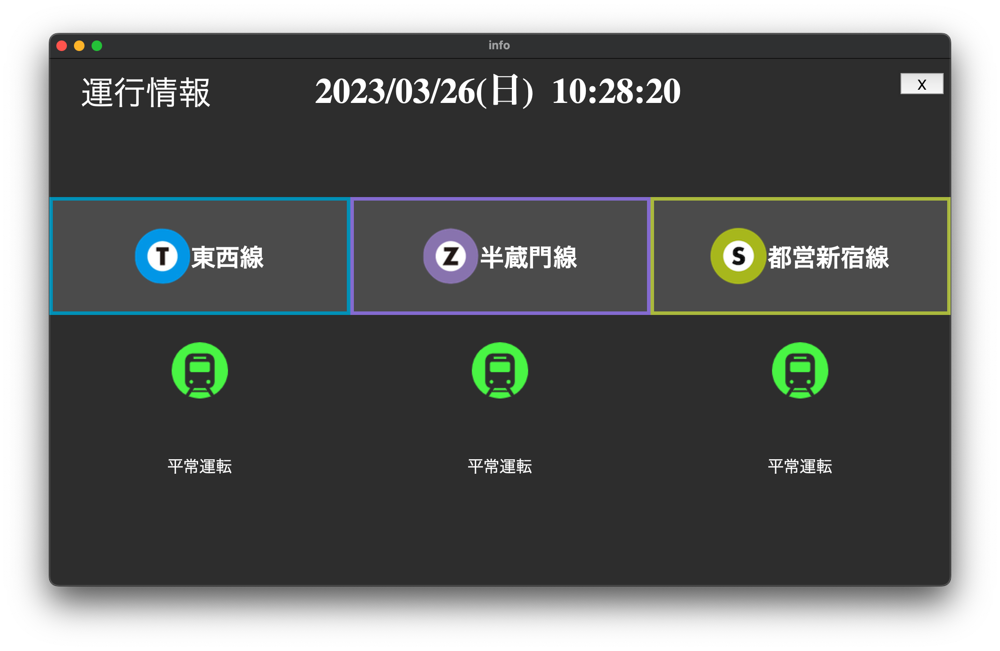
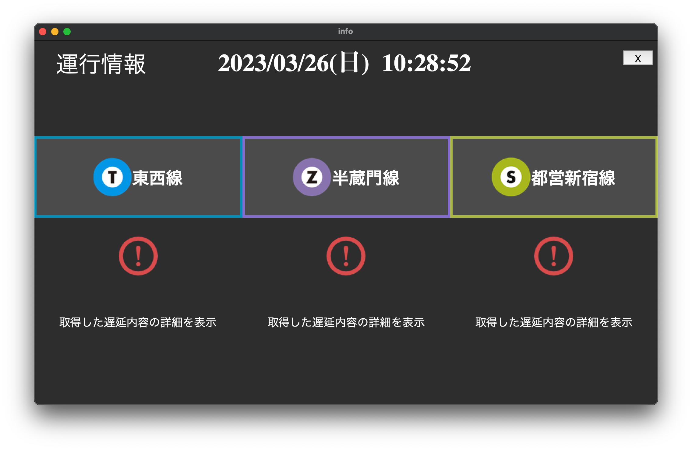
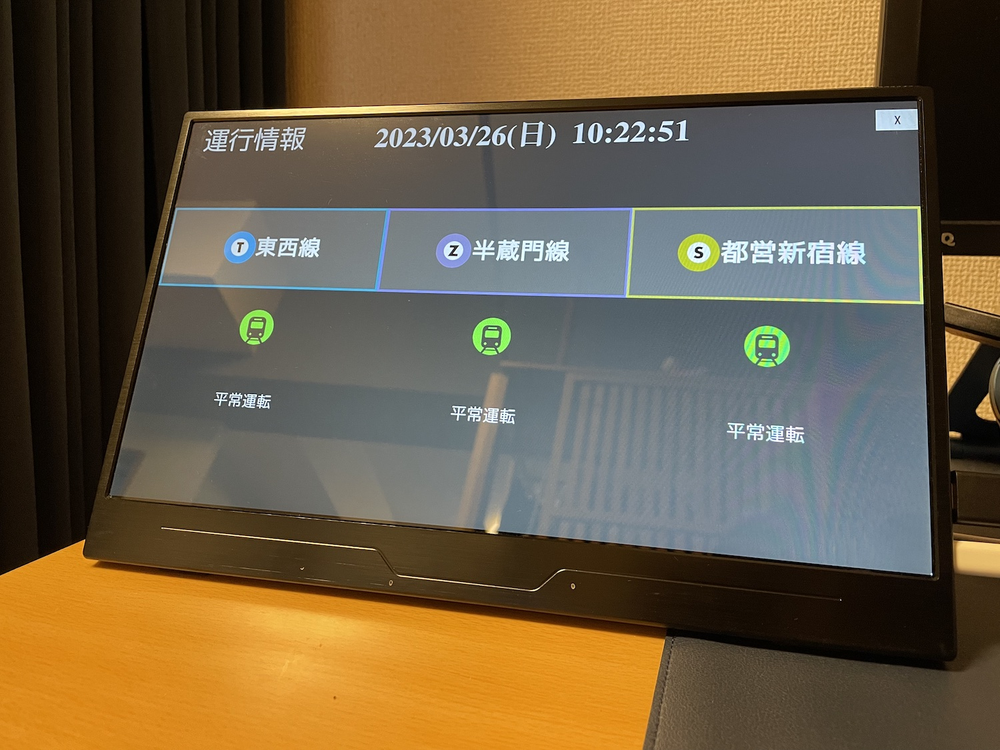
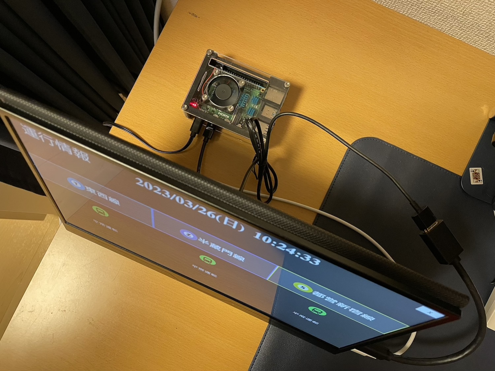

# train-info

## 概要

現在の路線状況を表示するアプリ

## 表示内容

各路線毎に以下の表示になっています

| 路線アイコンと路線名 |
| :------------------: |
|   運行状況アイコン   |
|   運行状況テキスト   |

## 画面表示

### 正常画面 

### 異常がある場合の画面 

## 使用している API など

[公共交通オープンデータセンター](https://www.odpt.org/)から取得したデータをもとに表示しています。 
路線アイコンについても同様です。

路線状況アイコンは[ICOOON MONO](https://icooon-mono.com/)から利用。

## Raspberry Pi でのサイネージ化

Raspberry Pi でアプリを実行し、小型のディスプレイに出力

